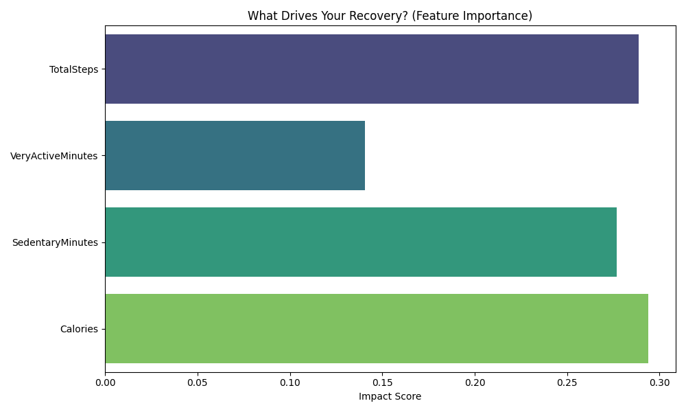

# 🛡️ VitalSense: Predictive Health Recovery Dashboard

A Data Science project that bridges the gap between raw wearable sensor data and actionable health insights. This application uses a Random Forest Machine Learning model to predict a user's "Recovery Score" based on their previous day's activity metrics.

## 📌 The Problem
Most fitness trackers provide data (steps, heart rate, sleep) but fail to explain how these metrics interact. Users often struggle to determine if they are physically ready for intense training or if they require rest. **VitalSense** solves this by providing an objective, data-driven readiness score.

## 🧪 Methodology
### 1. Data Processing
Using the **Fitbit Fitness Tracker Dataset**, I developed a pipeline to:
* **Synchronize** disparate time-series data (Heart Rate, Activity and Sleep).
* **Extract Resting Heart Rate (RHR):** Isolate HR pings between 2 AM and 4 AM to establish a baseline for autonomic nervous system recovery.

### 2. Feature Engineering
I calculated custom health indicators including:
* **Sleep Efficiency:** Ratio of total sleep to time in bed.
* **Recovery Score (Target):** A weighted index combining RHR efficiency (40%) and Sleep Quality (60%).

### 3. Machine Learning
I utilized a **Random Forest Regressor** ($N=100$) to identify non-linear relationships between daily exertion and recovery.
* **Model Accuracy:** The model achieved a Mean Absolute Error (MAE) of ~9.58 points on a 0-100 scale.

## 📊 Key Insights
According to the model's **Feature Importance**, the top drivers for physical recovery are:
1. **Total Steps** (Highest impact)
2. **Calories Burned**
3. **Sedentary Minutes**

---

## 🚀 How to Run
### 1. Prerequisites
- Python 3.9+
- Fitbit Dataset ([CSV files](https://www.kaggle.com/datasets/arashnic/fitbit?select=mturkfitbit_export_3.12.16-4.11.16))

### 2. Installation
1. Clone the repo.
2. Install dependencies.
3. Run the dashboard: streamlit run app.py